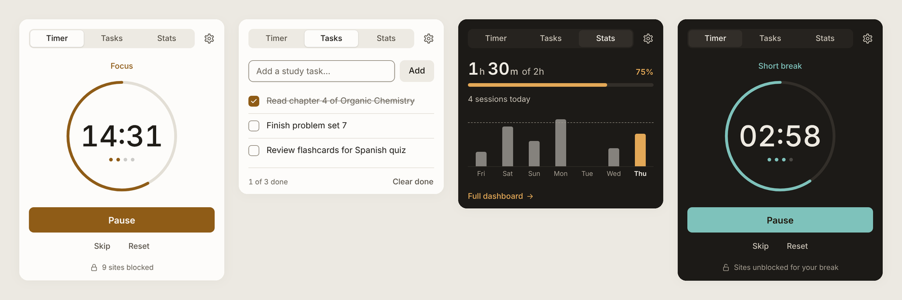
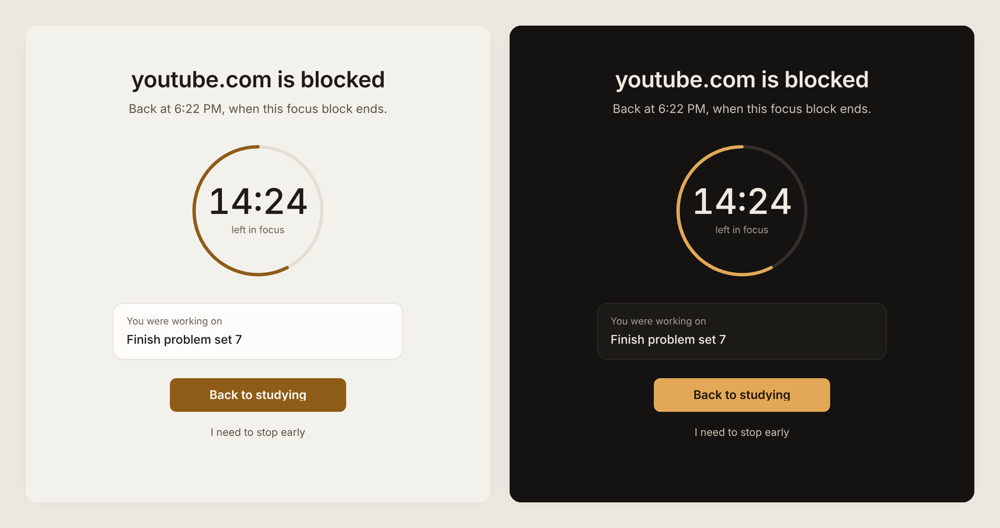
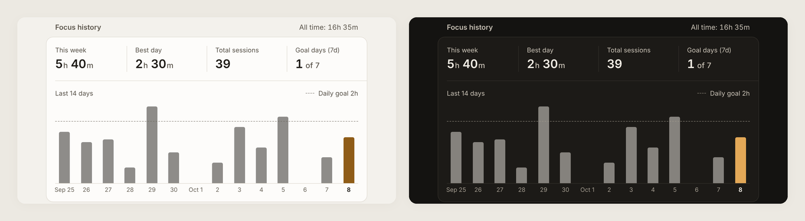
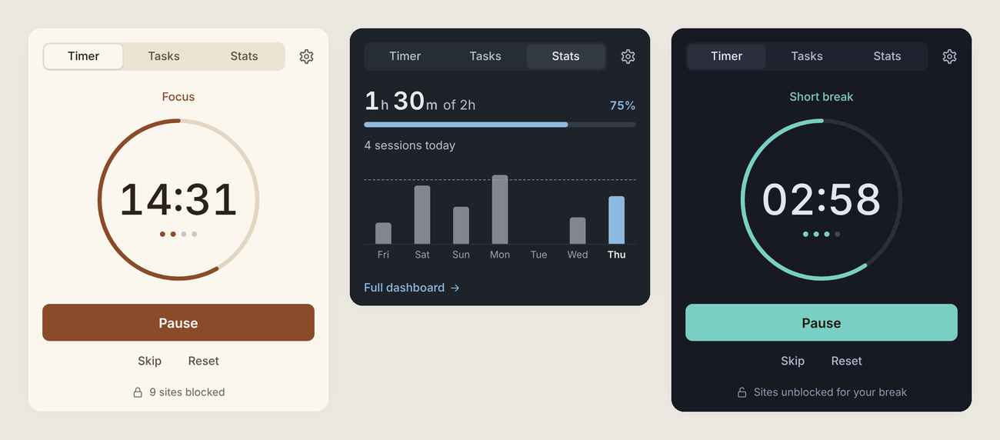
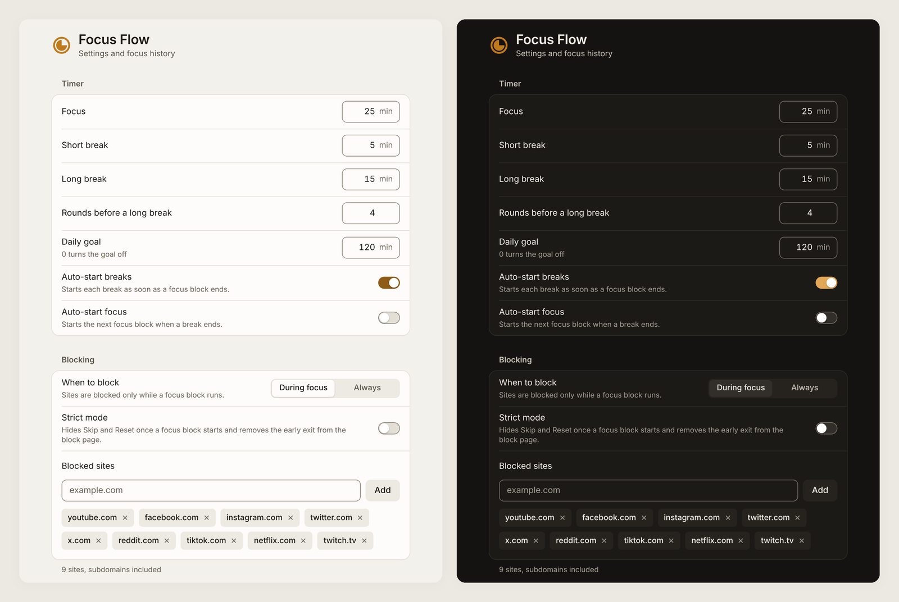
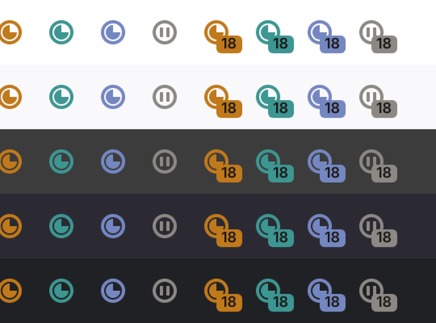

<p align="center">
  
</p>

<h1 align="center">Focus Flow</h1>

<p align="center">
  A calm Pomodoro timer and site blocker for studying, with a task list and private focus history.<br>
  Chrome, Edge and Firefox. Manifest V3, no build step, no dependencies, no tracking.
</p>

<p align="center">
  
</p>

## What it does

Start a focus block from the toolbar. While it runs, the sites you chose are
blocked, the toolbar shows how many minutes are left, and a short break starts
when the block ends. After a few rounds you get a longer break. Every finished
block is added to your history, so you can see how much you actually studied
this week.

### Timer

- Focus, short break and long break with your own lengths, and the number of
  rounds before a long break.
- Optional auto-start for breaks and for the next focus block.
- A toolbar icon that changes with the phase (focus, short break, long break,
  paused), a minute countdown on the badge, and a tooltip that names the state.
- One quiet notification at the end of each phase, never in the middle of one.
- Keeps running correctly across a browser restart, an extension update or a
  sleeping laptop. A block that finished while the browser was closed is
  counted on the day it ended.

### Blocker

- Blocks the sites on your list during focus, or all the time if you prefer.
  Subdomains are included, and the list holds up to 1,000 sites.
- Blocked pages open a calm block page instead of the site. It names the site,
  says when it unblocks, and shows the task you were working on.
- Leaving early takes a deliberate three-second hold, so a reflex click does
  not end your session.
- Strict mode removes Skip, Reset and the early exit once a focus block has
  started.

<p align="center">
  
</p>

### Tasks and history

- A short task list for the session. The first unfinished task appears on the
  block page as a reminder.
- Today's focus time against your daily goal, sessions completed, and a streak
  that only appears once it is worth showing.
- The settings page shows this week, your best day, total sessions, goal days
  and a 14-day chart. Time that crosses midnight is split between the two days.
- Export everything as JSON at any time.

<p align="center">
  
</p>

### Appearance

- Follows your system light or dark setting by default.
- Sepia, Slate and Night themes, and five accent colours (Ochre, Clay, Rose,
  Plum, Graphite) for the light and dark themes.

<p align="center">
  
</p>

## Install

Focus Flow is not in an extension store yet, so you load it from this folder.

### Chrome, Edge or Brave (version 121 or later)

1. Download this repository (Code → Download ZIP) and unzip it.
2. Open `chrome://extensions` (or `edge://extensions`).
3. Turn on **Developer mode**.
4. Click **Load unpacked** and select the unzipped `focus-flow` folder.
5. Pin Focus Flow to the toolbar from the puzzle-piece menu.

### Firefox (version 121 or later)

1. Open `about:debugging#/runtime/this-firefox`.
2. Click **Load Temporary Add-on** and choose `manifest.json` in this folder.
3. Firefox asks for site access separately. Open Settings from the popup and
   click **Allow site access** so blocked sites show the Focus Flow block page.

Temporary add-ons are removed when Firefox restarts. To keep it installed,
sign the add-on through [addons.mozilla.org](https://addons.mozilla.org/developers/).

### Updating

After pulling new changes, click the reload button on Focus Flow in
`chrome://extensions`. Your settings, tasks and history are kept.

## Settings

<p align="center">
  
</p>

| Setting | Default | Notes |
| --- | --- | --- |
| Focus | 25 min | 1 to 180 |
| Short break | 5 min | 1 to 90 |
| Long break | 15 min | 1 to 90 |
| Rounds before a long break | 4 | 1 to 12 |
| Daily goal | 120 min | 0 turns the goal off |
| Auto-start breaks | On | |
| Auto-start focus | Off | |
| When to block | During focus | or Always |
| Strict mode | Off | |
| Notifications | On | |

## Design

The interface was rebuilt with a few rules in mind, drawn from Apple's Human
Interface Guidelines, WCAG 2.2, and published research on first impressions,
visual complexity, display polarity and progress feedback.

- **One surface, little decoration.** No cards inside cards, no gradients, no
  emoji. The timer is the only large element in the popup.
- **Colour means state.** Ochre is focus, teal is a short break, dusk blue is
  a long break, grey is paused. Every state is also written out in text.
- **Readable in light and dark.** Text meets at least 4.5:1 contrast, controls
  and chart bars at least 3:1, in all five themes. Dark mode uses its own
  lighter accent colours instead of reusing the light ones.
- **System fonts.** The clock uses your system font with tabular figures, so
  digits don't shift as they count down.
- **Accessible.** Full keyboard support, visible focus rings, labels for
  screen readers, reduced-motion support, and Windows High Contrast mode.

The toolbar icon is a ring with a timer wedge, drawn by
`tools/make-icons.js`. Each phase has its own colour and paused has its own
shape, so it reads at 16 px on light and dark toolbars.

<p align="center">
  
</p>

## Privacy and permissions

Everything stays on your device in `chrome.storage.local`. There are no
accounts, servers, analytics or network requests.

| Permission | Why |
| --- | --- |
| `storage` | Saves your settings, tasks, timer and history on this device. |
| `alarms` | Ends each phase on time, even when the popup is closed. |
| `notifications` | Tells you when a focus block or break ends. You can turn this off. |
| `declarativeNetRequest` | Blocks the sites on your list. |
| Site access (`<all_urls>`) | Lets the blocker send blocked sites to the Focus Flow block page. Without it, they still fail to load but show the browser's own error page. |

## Project structure

```
focus-flow/
  manifest.json
  icons/                 app icons, plus per-phase toolbar icons in icons/toolbar/
  src/
    background.js        timer state, alarms, blocking rules, badge, notifications
    lib/common.js        storage, stats, formatting, domains and themes
    lib/theme.css        colour tokens and shared components
    popup/               toolbar popup: timer, tasks, today's stats
    options/             settings and focus history
    blocked/             block page
  tools/make-icons.js    renders every icon (node tools/make-icons.js)
  docs/screenshots/      images used in this README
```

There is no build step. Edit a file, then reload the extension.

## Known limitations

- In Chrome and Edge Incognito windows, a blocked site shows the browser's
  "blocked by an extension" page instead of the Focus Flow block page.
- Strict mode can still be switched off from Settings during a focus block.
- History lives in this browser only. Use Export to keep a copy.
